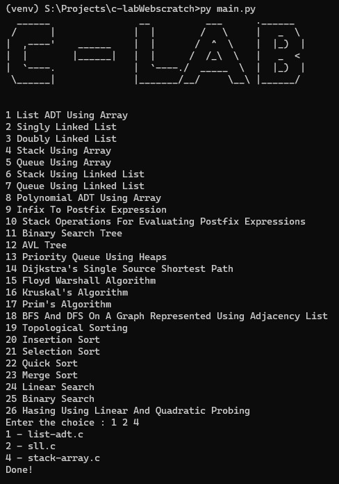

# c-labWebscratch

This is a fun project to scrap a data from the website. And a main objective is to ease the copy process.

## How to work with it

Simply clone this repo.

> `git clone https://github.com/Vishallas/c-labWebscratch.git`

Then install requests(HTTP library) in python,

> `pip install requests`

With this you're ready to use it. Just run the **main.py** file in terminal or cmd.

## Demo

The output of the main.py will be like below one.

---

Take a look at [My friend's site](https://ece-clab.netlify.app)

added test.
